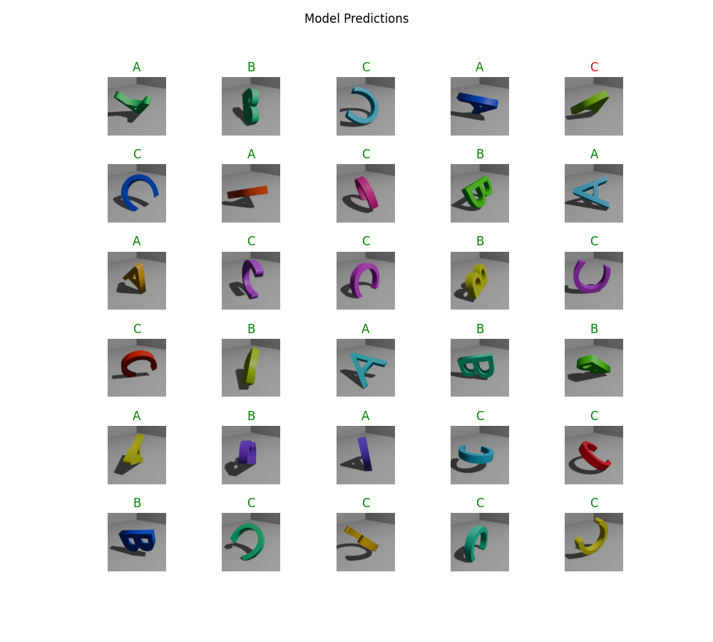
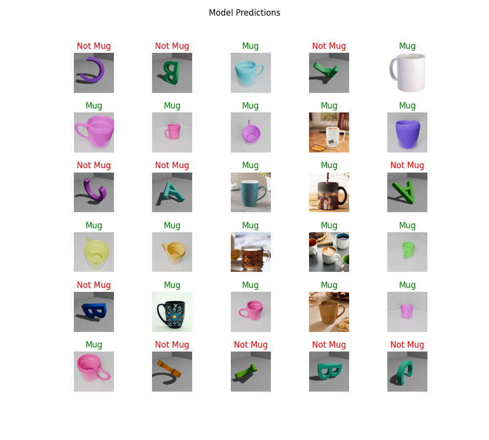

# BlenderSynth

This repo contains all the code that we used for the duration of our internship at Indian Statistical Institute, Kolkata.


## Team members

- Khushi Mehta
- Md Saad
- Subhra Chakraborty
- Ankita Dhara


## To Run

### A. Dataset Generation

We used two scripts, and two different model files to prepare dataset generation.

#### 1. 3D-Letter Generation(multi-class dataset)
- Uses 3 letters for now(A, B and C). Can be increased based on the requirement.
- Randomly rotates the object and allots a material.


#### 2. Mug Generation(single-class dataset)
- Uses a mug model. Can be changed to required object.
- Randomly rotates the object and allots the material.
- Randomly moves the camera along a specified but extensive path, making the dataset to have multiple angles

### B. Model Training

#### 1. Multi Class Classifier
a. Target: Classifier that detects which class the shown image belongs to

b. Using:
```
	i. MobileNet V2 from Google, Image Shape supported - (224, 224)

	ii. Python 3.8.0, Tensorflow 2.13.0, Tensorflow Hub, Matplotlib 3.7.5, Numpy 1.24.3, Scipy 1.10.1
```
c. Training: We did not retrain the model, we just added the last layers with our data(Mug and Not Mug). Input size was (224, 224, 3). 
Model Parameters:
```
	Layer 1: MobileNet, Output shape: (None, 1280), Parameters: 2,257,984, Trainable: No(we locked training to prevent back propagation)

	Layer 2: Dense(custom classification head), Output shape: (None, 3), Parameters: 3,843, Trainable: Yes


	Total: 2,261,827

	Trainable: 3,843(≈0.017%)

	Non-Trainable: 2,257,984
```

We trained using Adam optimizer, 20 Epochs, Batch size was 16.

Values on final epoch: 
```
Accuracy 99.82%
Loss 2.01%
Val Accuracy 97.17% 
Val Loss 7.37%
```

Test: Model correctly guessed all of the shown pictures except one. Attached related picture beneath.
<p align="center">

</p>

#### 2. Binary Classifier
a. Target: Classifier that detects if shown image contains a mug or not

b. Using:
```  
    i. MobileNet V2 from Google, Image Shape supported - (224, 224)

	ii. Python 3.8.0, Tensorflow 2.13.0, Tensorflow Hub, Matplotlib 3.7.5, Numpy 1.24.3, Scipy 1.10.1 
```

c. Training: We did not retrain the model, we just added the last layers with our data(Mug and Not Mug). Input size was (224, 224, 3). 
Model Parameters:
```
	Layer 1: MobileNet, Output shape: (None, 1280), Parameters: 2,257,984, Trainable: No(we locked training to prevent back propagation)

	Layer 2: dense_4(custom classification head), Output shape: (None, 1), Parameters: 1,281, Trainable: Yes


	Total: 2,259,265

	Trainable: 1,281(≈0.06%)

	Non-Trainable: 2,257,984
```


We trained using Adam optimizer, 20 Epochs, Batch size was 16.

Values on final epoch: 
```
Accuracy 100%
Loss 0.094%
Val Accuracy 100%
Val Loss 0.08%
```


<p align="center">

</p>

Test: Model correctly guessed all of the shown pictures(Not Mug folder contained pictures from our previous attempt at creating a multiclass classifier that distiguished between 3D renders of letters).
## Acknowledgements

 - [3D Rendered Datasets in Blender - Immersive Limit](https://www.youtube.com/watch?v=E1Pqpfg5kSo&list=PLq7npTWbkgVD9KdMI_EekeaRcM7vFXCT0)
 - [MobileNetV2](https://www.kaggle.com/models/google/mobilenet-v2/tensorFlow2/100-224-feature-vector/1?tfhub-redirect=true)
